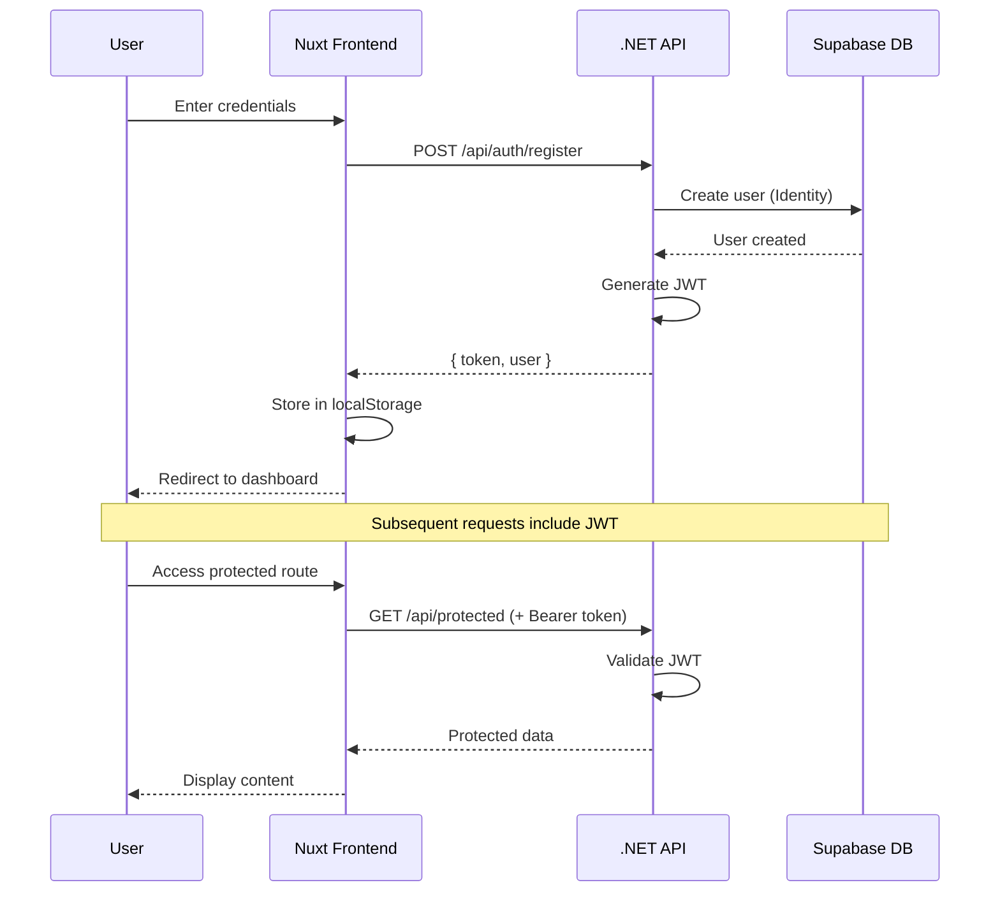

<div align="center">

<!-- Animated Header -->


<!-- Typing Animation -->
<a href="https://git.io/typing-svg"></a>

<!-- Badges -->
<p>
  
  
  
  
</p>

<p>
  
  
  
  
</p>

---

**A full-stack, interactive developer portfolio that's more than just a static site.**  
**It's a playground where users can explore, interact, and experience.**

[Live Demo](#) · [Documentation](./docs/README.md) · [Roadmap](./docs/ROADMAP.md) · [Report Bug](../../issues)

</div>

---

## ✨ What Makes This Different?

<table>
<tr>
<td width="50%">

### 🎭 Not Just a Portfolio
This isn't your typical "here's my work" website. It's an **interactive playground** where visitors can:
- Test animation snippets in real-time
- Explore projects with immersive transitions
- Experience smooth, scroll-triggered animations
- Copy and modify code directly

</td>
<td width="50%">

### 🔐 Full-Stack Power
Behind the scenes, a robust backend handles:
- JWT-based authentication
- Content management via API
- User sessions & subscriptions
- PostgreSQL database with Supabase

</td>
</tr>
</table>

---

## 🏗️ Architecture

```
┌─────────────────────────────────────────────────────────────────┐
│                         FRONTEND                                 │
│  ┌─────────────────────────────────────────────────────────┐    │
│  │                    Nuxt 4 / Vue 3                        │    │
│  │  ┌──────────┐ ┌──────────┐ ┌──────────┐ ┌──────────┐   │    │
│  │  │  Pages   │ │Components│ │Composables│ │ Plugins  │   │    │
│  │  └──────────┘ └──────────┘ └──────────┘ └──────────┘   │    │
│  │         ↓           ↓            ↓            ↓         │    │
│  │  ┌─────────────────────────────────────────────────┐   │    │
│  │  │     GSAP • ScrollTrigger • SplitText • Pinia    │   │    │
│  │  └─────────────────────────────────────────────────┘   │    │
│  └─────────────────────────────────────────────────────────┘    │
│                              │                                   │
│                         HTTP/REST                                │
│                              ↓                                   │
├─────────────────────────────────────────────────────────────────┤
│                          BACKEND                                 │
│  ┌─────────────────────────────────────────────────────────┐    │
│  │                  .NET 10 Web API                         │    │
│  │  ┌──────────┐ ┌──────────┐ ┌──────────┐ ┌──────────┐   │    │
│  │  │Controllers│ │ Services │ │  Models  │ │   Auth   │   │    │
│  │  └──────────┘ └──────────┘ └──────────┘ └──────────┘   │    │
│  │         ↓           ↓            ↓            ↓         │    │
│  │  ┌─────────────────────────────────────────────────┐   │    │
│  │  │   Entity Framework Core • JWT • ASP.NET Identity │   │    │
│  │  └─────────────────────────────────────────────────┘   │    │
│  └─────────────────────────────────────────────────────────┘    │
│                              │                                   │
│                         TCP/SSL                                  │
│                              ↓                                   │
├─────────────────────────────────────────────────────────────────┤
│                         DATABASE                                 │
│  ┌─────────────────────────────────────────────────────────┐    │
│  │              Supabase (PostgreSQL)                       │    │
│  │  ┌──────────┐ ┌──────────┐ ┌──────────┐ ┌──────────┐   │    │
│  │  │  Users   │ │ Projects │ │  Blogs   │ │ Snippets │   │    │
│  │  └──────────┘ └──────────┘ └──────────┘ └──────────┘   │    │
│  └─────────────────────────────────────────────────────────┘    │
└─────────────────────────────────────────────────────────────────┘
```

---

## 🚀 Quick Start

### Prerequisites

- [Node.js](https://nodejs.org/) v20+ or [Bun](https://bun.sh/)
- [.NET SDK](https://dotnet.microsoft.com/download) 10.0+
- [Supabase](https://supabase.com/) account (or local PostgreSQL)

### 1️⃣ Clone & Setup

```bash
git clone https://github.com/yourusername/myPortfolio.git
cd myPortfolio
```

### 2️⃣ Configure Environment

Create a `.env` file in the root:

```env
# Database (Supabase)
DB_HOST=db.your-project.supabase.co
DB_PORT=5432
DB_NAME=postgres
DB_USER=postgres
DB_PASSWORD=your_password

# JWT Configuration
JWT_KEY=your_super_secret_key_at_least_32_characters
JWT_ISSUER=MyPortfolio
JWT_AUDIENCE=MyPortfolioUsers
JWT_EXPIRE_MINUTES=60
```

### 3️⃣ Start the Backend

```bash
cd api
dotnet ef database update  # Apply migrations
dotnet run                 # Start API on http://localhost:5266
```

### 4️⃣ Start the Frontend

```bash
cd web
bun install    # or npm install
bun dev        # Start on http://localhost:3000
```

---

## 📁 Project Structure

```
myPortfolio/
├── 📂 api/                      # .NET Backend
│   ├── 📂 Controllers/          # API endpoints
│   │   └── AuthController.cs    # Authentication routes
│   ├── 📂 Data/                 # Database context
│   │   └── AppDbContext.cs      # EF Core setup
│   ├── 📂 Models/               # Data models
│   │   ├── AppUser.cs           # User entity
│   │   └── JwtSettings.cs       # JWT configuration
│   ├── 📂 Services/             # Business logic
│   │   └── TokenService.cs      # JWT generation
│   ├── 📂 Migrations/           # Database migrations
│   └── Program.cs               # App configuration
│
├── 📂 web/                      # Nuxt Frontend
│   ├── 📂 app/
│   │   ├── 📂 pages/            # Route pages
│   │   │   ├── index.vue        # Home page
│   │   │   └── auth.vue         # Login/Register
│   │   ├── 📂 composables/      # Vue composables
│   │   │   └── useAuth.ts       # Auth state management
│   │   └── app.vue              # Root component
│   ├── 📂 plugins/              # Nuxt plugins
│   │   └── auth.client.ts       # Auth initialization
│   ├── 📂 styles/               # Global styles
│   └── nuxt.config.ts           # Nuxt configuration
│
├── 📂 shared/                   # Shared code
│   └── types.ts                 # TypeScript types
│
├── 📂 docs/                     # Documentation
│   ├── README.md                # Docs home
│   ├── ROADMAP.md               # Project roadmap
│   └── CHANGELOG.md             # Version history
│
└── .env                         # Environment variables
```

---

## 🔐 Authentication Flow



---

## 🎨 Animation Playground

<table>
<tr>
<td align="center">

<br/>
<b>Split Text</b>
</td>
<td align="center">

<br/>
<b>Scroll Triggers</b>
</td>
<td align="center">

<br/>
<b>Interactive UI</b>
</td>
</tr>
</table>

The playground lets users:
- 🧪 **Test** animation snippets in real-time
- 📋 **Copy** code with one click
- 🎛️ **Modify** parameters and see instant results
- 💾 **Save** favorite snippets (authenticated users)

---

## 🛠️ Tech Stack

<table>
<tr>
<th>Layer</th>
<th>Technology</th>
<th>Purpose</th>
</tr>
<tr>
<td><b>Frontend</b></td>
<td>


</td>
<td>SSR, routing, reactivity</td>
</tr>
<tr>
<td><b>Styling</b></td>
<td>


</td>
<td>Utility-first CSS, components</td>
</tr>
<tr>
<td><b>Animation</b></td>
<td>


</td>
<td>Advanced animations</td>
</tr>
<tr>
<td><b>Backend</b></td>
<td>


</td>
<td>REST API, ORM, Identity</td>
</tr>
<tr>
<td><b>Auth</b></td>
<td>


</td>
<td>Secure authentication</td>
</tr>
<tr>
<td><b>Database</b></td>
<td>


</td>
<td>Cloud-hosted database</td>
</tr>
</table>

---

## 📚 API Endpoints

| Method | Endpoint | Description | Auth |
|--------|----------|-------------|------|
| `POST` | `/api/auth/register` | Create new account | ❌ |
| `POST` | `/api/auth/login` | Login & get JWT | ❌ |
| `GET` | `/api/projects` | List all projects | ❌ |
| `GET` | `/api/projects/:slug` | Get project by slug | ❌ |
| `GET` | `/api/blogs` | List all blog posts | ❌ |
| `GET` | `/api/playground` | List animation snippets | ❌ |
| `POST` | `/api/playground` | Create snippet | ✅ |

---

## 🤝 Contributing

Contributions are welcome! Please read the [contributing guidelines](./docs/CONTRIBUTING.md) first.

```bash
# Fork the repo
# Create your feature branch
git checkout -b feature/amazing-feature

# Commit your changes
git commit -m 'Add some amazing feature'

# Push to the branch
git push origin feature/amazing-feature

# Open a Pull Request
```

---

## 📄 License

This project is licensed under the MIT License - see the [LICENSE](LICENSE) file for details.

---

<div align="center">


**Built with ❤️ by [Judah Sullivan](https://github.com/judahsullivan)**

<p>
<a href="https://github.com/judahsullivan"></a>
<a href="https://linkedin.com/in/judahsullivan"></a>
<a href="https://twitter.com/judahsullivan"></a>
</p>

</div>
